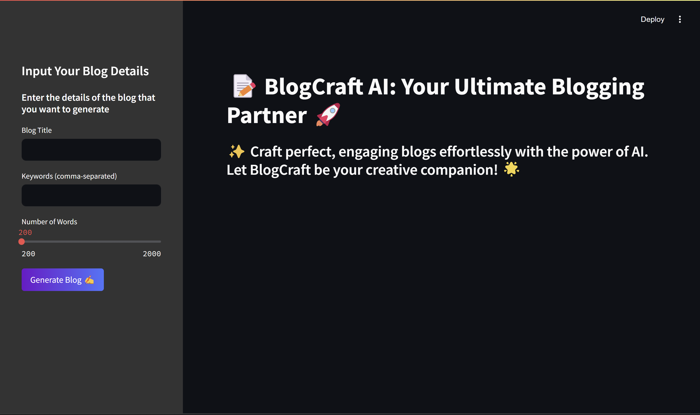

# BlogCraft AI

BlogCraft AI is an advanced blog generation tool that leverages cutting-edge language models like Google Gemini LLM and the LangChain framework to produce high-quality, context-aware, and engaging blog content effortlessly. Whether you're a blogger, marketer, or content strategist, BlogCraft AI simplifies the process of creating professional-grade articles tailored to your needs.

---

## Features

- *AI-Powered Content Creation:* Generate blogs on any topic with contextually rich and coherent narratives.
- *Customizable Outputs:* Tailor tone, style, and length to suit your audience.
- *Multi-Language Support:* Expand your reach by creating content in multiple languages.
- *Seamless Integration:* Easily integrate with your existing workflows via LangChain.
- *Dynamic Imagery:* Add placeholders or auto-suggest relevant images for your blogs.

---

## How It Works

1. *Input Topic:* Provide a topic or a brief description of the desired blog.
2. *Generate Content:* BlogCraft AI uses Google Gemini LLM and LangChain to create a structured and compelling blog draft.
3. *Refine and Customize:* Edit or refine the generated content to align with your vision.
4. *Export and Publish:* Export the content in your preferred format and publish it with ease.

---

## Technologies Used

- *Google Gemini LLM:* A powerful language model for generating human-like text.
- *LangChain Framework:* Provides tools for building end-to-end LLM-powered workflows.
- *Python:* Core programming language for backend and integration.

---

## Installation

1. Clone the repository:
   bash
   git clone https://github.com/your-username/BlogCraft-AI.git
   cd BlogCraft-AI
   
2. Install the required dependencies:
   bash
   pip install -r requirements.txt
   
3. Set up your API keys for Google Gemini LLM and other services in the .env file.
4. Run the application:
   bash
   python app.py
   

---

## Screenshots

()

---

## Placeholder for Application Images

(Replace these placeholders with your application images)

1. *Home Screen*
   

2. *Blog Generation Screen*
   

## Future Enhancements

- Integration with popular CMS platforms (e.g., WordPress, Medium).
- Enhanced personalization with user-specific training data.
- Support for real-time collaboration and feedback.
- Advanced SEO suggestions.

---

## Contributing

Contributions are welcome! Please open an issue or submit a pull request with your suggestions or improvements.

---

## License

This project is licensed under the MIT License. See the [LICENSE](LICENSE) file for details.

---

## Acknowledgments

- Google for the Gemini LLM.
- LangChain team for their incredible framework.
- Open-source contributors for making this project possible.

---